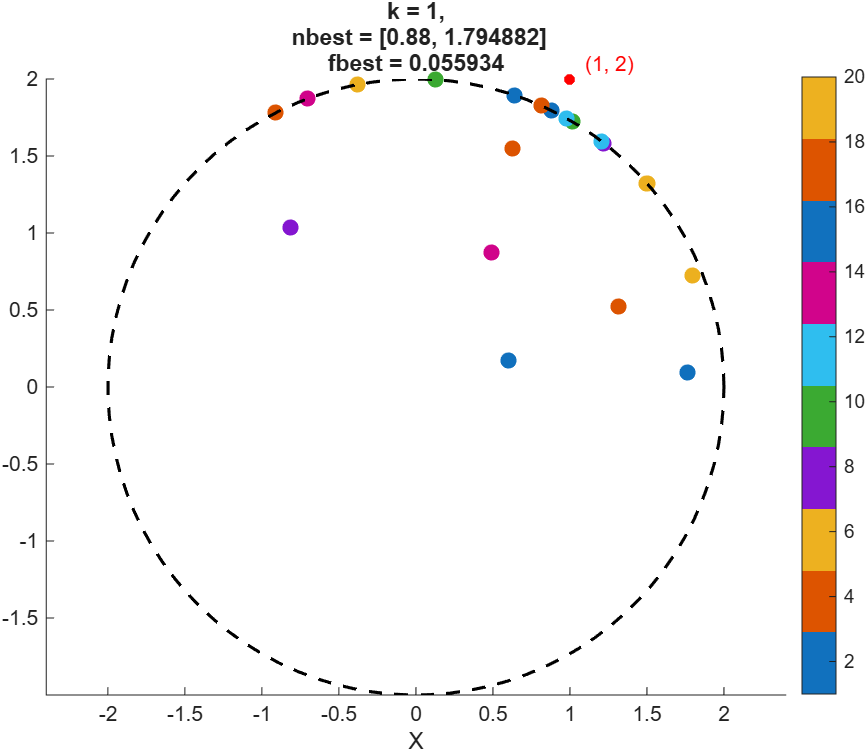
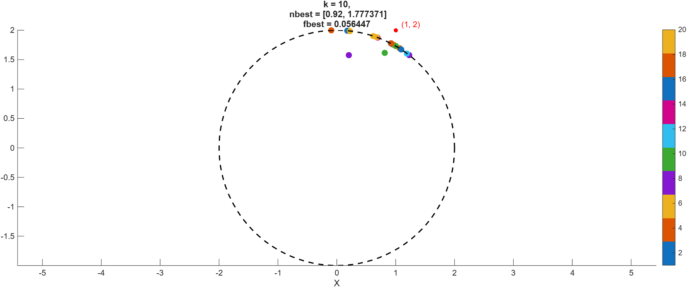
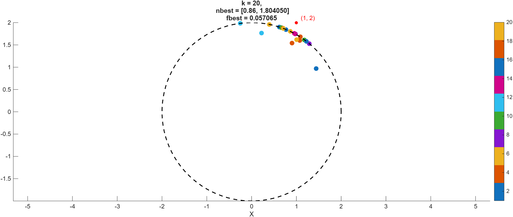
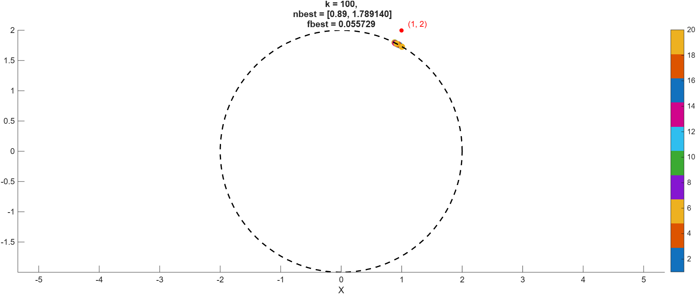
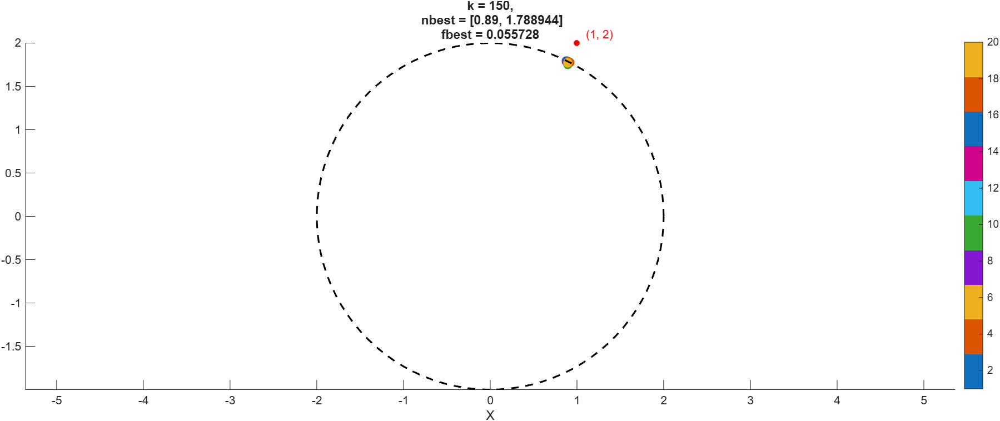

# Áp dụng thuật toán FA vào bài toán cụ thể
## Bài Toán Quy Hoạch Phi Tuyến 2 Chiều (NLP 2D)

Đây là một ví dụ về Bài toán Quy hoạch Phi tuyến tính (Nonlinear Programming - NLP) nhằm mục đích cực tiểu hóa một hàm mục tiêu lồi bị ràng buộc bởi các điều kiện bất đẳng thức phi tuyến.

---

### 1. Hàm Mục Tiêu (Objective Function)

Cực tiểu hóa hàm $f(x_1, x_2)$:

$$
\text{Minimize } f(x_1, x_2) = (x_1 - 1)^2 + (x_2 - 2)^2
$$

> **Đặc điểm:** Hàm này là một **hàm lồi (convex)**, là phương trình của một paraboloid mở lên, và có giá trị cực tiểu toàn cục không ràng buộc tại điểm $(1, 2)$.

---

### 2. Các Ràng Buộc (Constraints)

Các biến $x_1$ và $x_2$ phải thỏa mãn các điều kiện sau:

#### Ràng buộc Bất đẳng thức Phi tuyến:

$$
x_1^2 + x_2^2 \le 4
$$

> **Giải thích:** Đây là miền bên trong và trên chu vi của một hình tròn có tâm tại gốc tọa độ $(0, 0)$ với bán kính $R = 2$.
### 3. Kết quả mong đợi
Đom đóm sáng nhất

$$\mathbf{nbest} = \left( \frac{2}{\sqrt{5}}, \frac{4}{\sqrt{5}} \right) \approx (0.894, 1.789)$$
Giá trị hàm mục tiêu tối thiểu
$$\mathbf{fbest} = 9 - 4\sqrt{5} \approx 0.0557$$

## Kết quả thực hiện thuật toán trên Mathlab
### Ở vòng lặp k = 1

### Ở vòng lặp k = 10

### Ở vòng lặp k = 20

### Ở vòng lặp k = 50

### Ở vòng lặp k = 100

### Ở vòng lặp k = 150

### Ở vòng lặp k = 200

### Ở vòng lặp k = 250

### Ở vòng lặp k = 300 (MAX_ITER)

